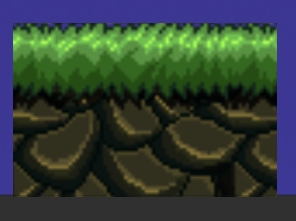
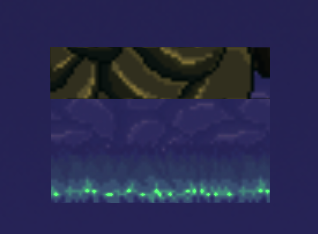

## 游戏介绍

​	JUMP 是一款 由 Construct3 从0开始制作的，2D 竖版平台跳跃游戏，玩家将扮演一名小骷髅人，一步一步跳跃，直至找到出路。

​	游戏设置了普通台阶、易碎台阶、传送门以及跳跃穿透台阶。

## 游玩演示

1. 通关演示

   
   
   
   <video src="Videos/jump_win.mkv"></video>
   
2. 失败演示

   

## 游戏制作

1. 易碎台阶

   1. 具体制作

      让主控角色触碰到易碎台阶时，摧毁台阶并加入音效。

      

   2. 素材制作

      为了让玩家区分出普通台阶和易碎台阶，在普通台阶上做部分挖空处理。

2. 传送门

   1. 具体制作

      让主控角色触碰到传送门时，移动到另一个传送门并加入音效。

3. 跳跃穿透台阶

   1. 思路

      为了让玩家意思到台阶可以从下往上跳跃，将普通台阶进行180°翻转，并将底部进行虚化处理，只保留上层清晰图片

      普通台阶：

      

      跳跃穿透台阶：

      

   2. 具体制作

      添加行为

      

4. 场景切换

   1. 新建场景，当主控角色触碰到当前场景的指定位置时，跳转到下一个需要场景。

